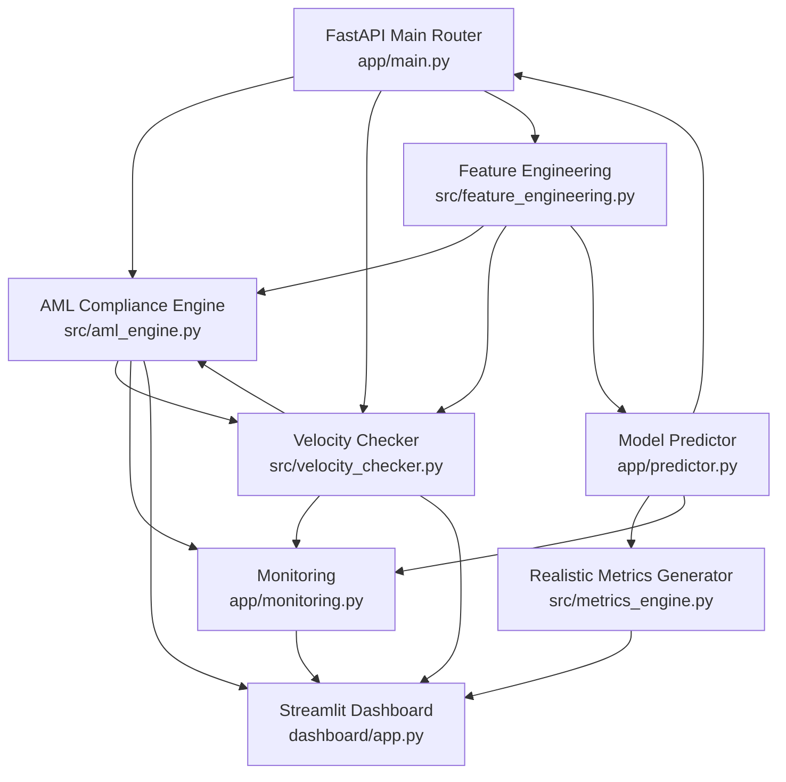

# Component Architecture

### New Components

#### AML Compliance Engine

**Responsibility:** Real-time Anti-Money Laundering pattern detection and compliance checking
**Integration Points:** 
- Extends existing FastAPI router in `app/main.py` with `/aml_check` endpoint
- Integrates with current feature engineering pipeline in `src/feature_engineering.py`
- Utilizes existing model loading patterns from `app/predictor.py`

**Key Interfaces:**
- `analyze_transaction_patterns(transaction_data: dict) -> AMLResult`
- `check_regulatory_thresholds(amount: float, frequency: int) -> ComplianceFlags`
- `screen_watchlist_entities(transaction: dict) -> List[WatchlistMatch]`

**Dependencies:**
- **Existing Components:** Uses current data validation from `app/models.py`, logging from `app/monitoring.py`
- **New Components:** Coordinates with VelocityChecker for comprehensive risk assessment

**Technology Stack:** Python/pandas for pattern analysis, existing scikit-learn for classification models

#### Velocity Checker

**Responsibility:** Multi-timeframe transaction velocity monitoring and risk scoring
**Integration Points:**
- Extends existing feature engineering in `src/feature_engineering.py` with velocity-specific features
- Integrates with current monitoring infrastructure in `app/monitoring.py`
- Follows existing caching patterns for performance optimization

**Key Interfaces:**
- `calculate_velocity_metrics(user_id: str, timeframes: List[str]) -> VelocityMetrics`
- `assess_velocity_risk(current_velocity: float, baseline: float) -> RiskScore`
- `update_velocity_baseline(user_id: str, transaction_history: List[dict]) -> None`

**Dependencies:**
- **Existing Components:** Leverages current data processing from `src/data_pipeline.py`, error handling patterns
- **New Components:** Provides velocity context to AMLComplianceEngine for enhanced analysis

**Technology Stack:** Python/pandas for time-series analysis, existing NumPy for statistical calculations

#### Realistic Metrics Generator

**Responsibility:** Replace artificial perfect metrics with honest, defensible performance reporting
**Integration Points:**
- Enhances existing model training pipeline in `src/model_training.py`
- Extends current evaluation framework in `src/evaluation.py`
- Integrates with existing dashboard metrics in `dashboard/components.py`

**Key Interfaces:**
- `generate_realistic_metrics(y_true: np.array, y_pred: np.array) -> PerformanceMetrics`
- `calculate_honest_accuracy(model: object, test_data: pd.DataFrame) -> float`
- `create_defendable_reports(metrics: dict) -> ReportData`

**Dependencies:**
- **Existing Components:** Uses current model artifacts, extends existing evaluation patterns
- **New Components:** Provides honest baseline for AML and velocity model performance comparison

**Technology Stack:** Enhanced scikit-learn evaluation, existing matplotlib/seaborn for visualization

### Component Interaction Diagram

